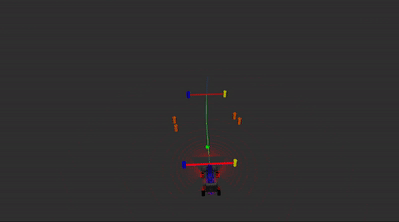

.. MUR Autonomous documentation master file, created by
   sphinx-quickstart on Thu Apr 24 02:56:53 2025.
   You can adapt this file completely to your liking, but it should at least
   contain the root `toctree` directive.

MUR Autonomous Home
====================

.. image:: _static/MURA_rviz2.gif
   :width: 75%

Welcome to the MUR Autonomous page. This site provides all the documentation an autonomous member needs to understand the MUR Autonomous Architecture.

.. note::

   This documentation is considered complete. However, we will always strive to improve our documentation and welcome contributions from others! :doc:`Click here to get in touch. <contact>`

- Check out the :doc:`Quick Start Guide <quick_start_guide>` to get a quick overview for MUR Autonomous.
- Visit the :doc:`Development Environment Setup <dev_setup>` section to see how to prepare a development environment suited for MUR Autonomous.
- Already know the theory? Test your knowledge with our :doc:`tutorials <tutorials/index>`.

.. toctree::
   :hidden:
   :caption: Getting Started
   :maxdepth: 2

   quick_start_guide
   sphinx_doc_guide
   dev_setup
   literature_resources
   contact

.. toctree::
   :hidden:
   :caption: Pipelines
   :maxdepth: 2

   pipeline_overview
   perception/index
   slam/index
   pathing/index
   controls/index

.. toctree::
   :hidden:
   :caption: Tutorials
   :maxdepth: 2

   tutorials/index

.. toctree::
   :hidden:
   :caption: Hardware
   :maxdepth: 2

   hardware/lidar