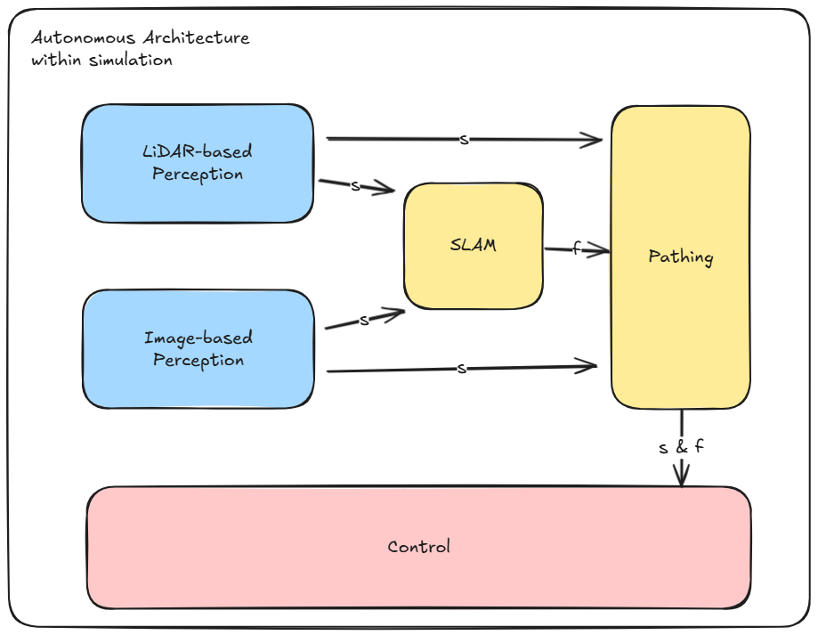

Pipeline Overview (TL;DR)
=========================

As outlined in the :doc:`Quick Start Guide <quick_start_guide>`, a *pipeline* is a structured sequence of processing stages, where each stage takes input, transforms it, and hands it off to the next. This modularity enables scalable development and easier maintenance. By embracing modularity, we avoid the nightmare of monolithic scripts that resist evolution. Imagine revisiting your code five years from now, only to find that convolutional neural networks for image detection have gone the way of the floppy disk. With well-isolated pipeline components, swapping in the latest detection algorithm becomes a minor update—not a total rewrite.

The following block diagram is the overall simplified architecture structure for use within the simulations.

Next, we have the overall proposed architecture for the physical system itself. The sensors are depicted in green blocks, the perception pipelines are depicted in blue, pipelines relating to mapping, localization, and path generation are depicted in yellow, and pipelines relating to movement commands are depicted in red. Lastly, actuators are depicted in purple blocks.

.. image:: _static/sim_arch2.png
    :width: 100%

We will go over a brief description of what each pipeline does and how it integrates with other pipelines.

Perception Pipeline
-------------------

There are two perception pipelines mainly for robustness and safety, i.e. should one fail, we can fall back to the other perception pipeline. These pipelines are the LiDAR-based and image-based pipelines respectively.

.. rubric:: LiDAR-based Perception

Structured as:

- Pre-Processing:
    - Removes the points behind the car using a box filter.
    - Applies a ground removal algorithm to separate cones from the ground.

- Cone Detection:
    - Clusters the point cloud.
    - Reconstructs cone regions from the original cloud to recover dropped points.
    - Filters clusters based on expected size and shape criteria derived from LiDAR parameters and distance

- Color Estimation:
    - Uses LiDAR intensity patterns to differentiate colors, e.g. yellow-black-yellow for yellow cones
    - Employs ML algorithms trained on the intensity of images to classify cones as blue, yellow, orange, or unknown.

.. rubric:: Image-based Perception

Structured as:

Pathing Pipeline
----------------

SLAM Pipeline
-------------

Controls Pipeline
-----------------