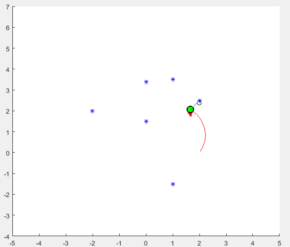

Simultaneous Localization and Mapping (SLAM)
============================================

What is SLAM? To appreciate the magic of SLAM—*Simultaneous Localization and Mapping*—we first need to unpack its two core components: **mapping** and **localization**.

Let’s begin with mapping. At its core, mapping is the act of reconstructing the environment around an autonomous system. Perception systems allow the vehicle to *see* its surroundings, but vision alone is fleeting. Without mapping, the system is like someone watching a movie with amnesia—everything seen is quickly forgotten. Mapping, then, is the mechanism that takes those raw perceptions and assembles them into a persistent, navigable model of the world.

Of course, maps aren’t always perfect—just as our memories can blur over time, mapping algorithms often construct an approximate representation of reality. After all, these systems don’t have perfect recall either.

Next up is localization. Once we have a map, the next question is: *Where am I on this map?* Localization answers this by estimating the vehicle's position and orientation (collectively called its *pose*) with respect to the map. It’s like dropping a pin on Google Maps, but done continuously and with far more math.

So where does SLAM come in? Traditionally, mapping and localization were done in sequence: first build a map, then localize within it. But real-world autonomous systems—especially in fast-paced domains like autonomous racing—don’t have the luxury of waiting. Enter SLAM: a real-time algorithmic framework that builds the map *and* localizes the vehicle within it *at the same time*. 

Hence the “simultaneous” in *Simultaneous Localization and Mapping*—a computational two-for-one deal that allows autonomous systems to explore and understand the world without needing a pre-made map. It's like learning where you are while simultaneously sketching the map on a moving train.

SLAMming Through the Track: FastSLAM 2.0
-----------------------------------------

Before you can follow a path, you need to *know where you are*. Welcome to the magical world of **SLAM** — *Simultaneous Localization and Mapping*. It’s like trying to draw a map of a maze while you’re running through it blindfolded with only a flashlight and some basic physics.

SLAM’s job is to let the car build a map of the track and localize itself within that map — at the same time. And in our case, that "map" is a jungle of yellow and blue cones.

.. note::

   In the FSAE autonomous world, the first lap is run without any prior map of the course. The car must detect cones, build the track boundaries, and localize itself all in real-time. It’s the cartographic equivalent of tightrope walking while juggling flaming torches — with traffic cones.

Enter FastSLAM 2.0
-------------------

FastSLAM is the rockstar of SLAM algorithms. More specifically, **FastSLAM 2.0** is the sequel that doesn’t disappoint. It fuses particle filters for localization and Extended Kalman Filters (EKFs) for mapping. It’s the computational version of a buddy cop movie — where one guy (the particle) figures out where the car is, and the other (the EKF) tracks where the cones are.

Here’s how FastSLAM 2.0 works, broken down with minimal hand waving:

1. **Particles**: Each particle is a guess of where the vehicle might be on the track.
2. **Landmark Estimation**: Each particle carries its own map of landmarks (cones), updated via an EKF.
3. **Importance Sampling**: Unlike FastSLAM 1.0, version 2.0 samples particles from a more accurate proposal distribution (not just motion model) — incorporating actual observations for better guesses.
4. **Weighting**: Each particle is scored based on how well its predicted cone map matches what the LiDAR sees.
5. **Resampling**: Low-score particles go home; high-score particles reproduce.

.. code-block:: python

   for particle in particles:
       particle.predict(motion_model)
       particle.update(observations, ekf_update)
       particle.weight = compute_likelihood(observations, particle.map)

   particles = resample(particles)

Why FastSLAM 2.0 Rocks for FSAE
-------------------------------

- **Low Latency Mapping**: It keeps the map updates localized to each particle’s belief, reducing overhead.
- **Handles Data Association**: Even if the cones look like an identical family reunion, FastSLAM's EKF per landmark helps keep track of who’s who.
- **Resilient to Sensor Noise**: Particle filtering and sensor fusion absorb errors better than your suspension over kerbs.

And best of all? It scales well — which matters when you're detecting a gazillion cones at 10 Hz while doing 40 kph around a hairpin.

Cone-clusion
------------

FastSLAM 2.0 allows the car to not only figure out *where it is* but also *what the track looks like* — all from raw sensor data. It's the foundation of autonomy during the first lap. Once a decent map is built, the vehicle can start to rely more on localization within that map and less on live mapping.

   *FastSLAM 2.0 illustrated: each particle holds a hypothesis of the car's pose and an associated map of cones.*

Up next? Feed that map into the path generation pipeline and let the car stretch its legs. But remember, it all starts with knowing where you are — and for that, we FastSLAM.