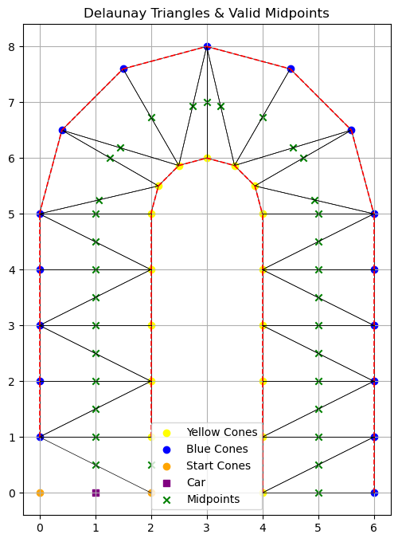
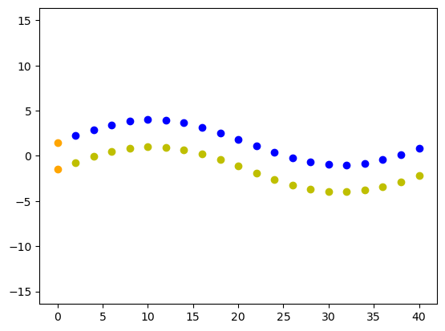
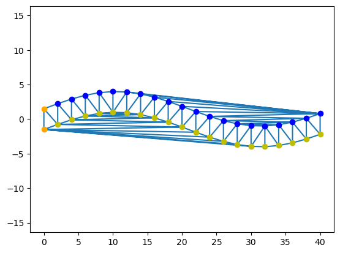
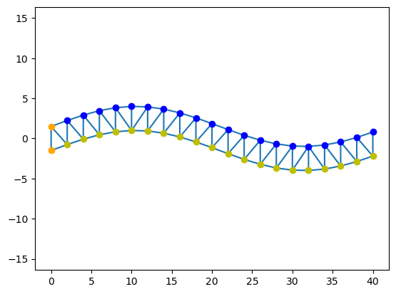
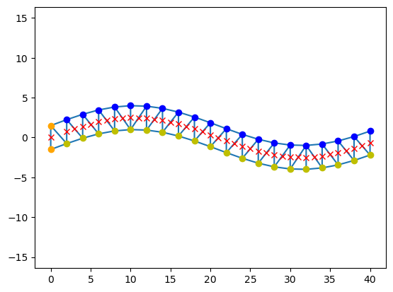

Path Generation with Delaunay Triangulation
===========================================

Welcome to the **Path Generation Tutorial**!

In this section, you'll learn how we extract a raceable centerline path from a cloud of cones using a computational geometry technique called **Delaunay triangulation**. Don't worry — it's way cooler than it sounds.

.. contents::
   :local:
   :depth: 2

What Are We Trying to Do?
----------------------------

Assume the car already knows where every blue and yellow cone is. The next step is to carve out a drivable corridor between the track boundaries. We do that with Delaunay triangulation: connect the cones, then join the mid-points of those connections to form a provisional centerline.

That centerline isn’t the fastest “racing line,” but it’s exactly what you want on the first lap, when there’s no pre-built map and cone positions keep appearing only as the LiDAR or cameras detect them. In that uncertain first lap, a geometric centerline is the safest, most reliable path—as long as the perception pipeline is solid.

Delaunay Triangulation
-------------------------

Our first tool: `scipy.spatial.Delaunay`

This algorithm connects points to form triangles such that no point is inside the circumcircle of any triangle. Here's how we use it:

.. code-block:: python

   # Suppose we have cone locations in the form of:
   cones_raw = [...] # We will treat the cone locations as a single point for now

   # --- Create Cone objects ---
   cones = [Cone(x, y, color) for ([x, y], color) in cones_raw]
   cone_positions = np.array([cone.get_position() for cone in cones])
   cone_colors = np.array([cone.color for cone in cones])

   # --- Delaunay triangulation ---
   triangles = Delaunay(cone_positions)

   # --- Plot ---
   plt.triplot(cone_positions[:,0], cone_positions[:,1], triangles.simplices)
   color_map = {"blue": 'b', "yellow": 'y', "orange": 'orange'}
   for cone in cones:
       plt.plot(cone.x, cone.y, 'o', color=color_map[cone.color])
   plt.axis("equal")
   plt.show()

Suppose the the top-down view of the track looked like:

The network of triangles that we created for the track using Delaunay() gives us:

This gives us a network of triangles spanning all cones in sight. But not all triangles are useful...

Filtering Valid Triangles
----------------------------

We *only* keep triangles that look like part of the track.

.. code-block:: python

   '''
   We grab the indices of cones/points forming the simplices in the triangulation and 
   use those indices to determine the color of the points of the cones
   '''
   simplices = triangles.simplices
   triangle_colors = cone_colors[simplices]

   '''
   Now we want to filter out only valid triangles using the color of the cones.
   If all three cones that form the triangle are the same color, it is considered
   invalid.
   '''
   mask = (
       (np.any(triangle_colors == 'yellow', axis=1) & np.any(triangle_colors == 'blue', axis=1)) |
       (np.sum(triangle_colors == 'orange', axis=1) == 2)
   )

   valid_triangles = simplices[mask]

This skips triangles with cones all of the same color — those are likely from the same side of the track.

Constructing Midpoints
--------------------------

From each valid triangle, we extract **edges** that cross the track (i.e. one yellow + one blue cone). We take their midpoint as part of the path:

.. code-block:: python

   data = {
    'path': [],
    'path boundary': [],
    'valid edges': [],
    'seen edges': [],
   }

   for triangle_points in valid_triangles:
       for i in range(3):
           p1, p2 = sorted([triangle_points[i], triangle_points[(i + 1) % 3]])
           edge = (p1, p2)

           if edge in data['seen edges']:
               continue

           data['seen edges'].append(edge)

           cone1 = cones[p1]
           cone2 = cones[p2]

           color1 = cone1.color
           color2 = cone2.color

           if ('orange' not in [color1, color2]):
               if (color1 == color2):
                   data['path boundary'].append((cone1, cone2))

               else:
                   data['valid edges'].append((cone1, cone2))

                   midpoint = (
                       (cone1.x + cone2.x) / 2.0,
                       (cone1.y + cone2.y) / 2.0
                   )

                   data['path'].append(midpoint)

           else:
               if (color1 == color2):
                   data['valid edges'].append((cone1, cone2))

                   midpoint = (
                       (cone1.x + cone2.x) / 2.0,
                       (cone1.y + cone2.y) / 2.0
                   )

                   data['path'].append(midpoint)
               else:
                   dx = cone1.get_position()[0] - cone2.get_position()[0]
                   dy = cone1.get_position()[1] - cone2.get_position()[1]

                   if math.hypot(dx, dy) > 2:
                       data['valid edges'].append((cone1, cone2))

                       midpoint = (
                           (cone1.x + cone2.x) / 2.0,
                           (cone1.y + cone2.y) / 2.0
                       )

                   else:
                       data['path boundary'].append((cone1, cone2))
   plt.triplot(cone_positions[:,0], cone_positions[:,1], valid_triangles)
   color_map = {"blue": 'b', "yellow": 'y', "orange": 'orange'}
   for cone in cones:
       plt.plot(cone.x, cone.y, 'o', color=color_map[cone.color])
   for midpoint in data['path']:
       plt.plot(midpoint[0], midpoint[1], 'x', color='red')
   plt.axis("equal")
   plt.show()

   midpoint = (
       (cone1.x + cone2.x) / 2.0,
       (cone1.y + cone2.y) / 2.0
   )
   midpoints.append(midpoint)

These midpoints form our *centerline path*. Your car will eventually follow this!

Stipulations
------------

Realistically, in an actual FSAE Driverless trackdrive event, the track is completely unknown to the autonomous car for the first lap. After the first lap, the architecture should've built a map of the track. This means that, initially, all cone locations are unavailable to the car except for the cones in visible view **and** detected by the perception pipeline. Nevertheless, the process of finding the midpoints via Delaunay Triangulation remains the same.

Interactive Checkpoint
--------------------------

Here’s a fun mini-challenge!

#. Modify the filtering criteria to:
   - Only accept triangles with **exactly 1 yellow, 1 blue, and 1 orange** cone.
   - Bonus: Filter out midpoints that are **less than 2 meters** from any orange cone.

#. Print how many midpoints you generate each frame:

   .. code-block:: python

      print(f"Frame {self.i}: {len(self.path)} midpoints generated")

Summary
----------

You've just learned:

- What Delaunay triangulation is
- How we extract a driveable path using cone pair midpoints
- Why filtering and midpoint tracking matter

These midpoints will become the **target trajectory** for the path following algorithm (coming soon in the Pure Pursuit tutorial!).

Want More?
----------

Try extending this:

- Visualize edges used vs rejected (`valid_edges` vs `invalid_edges`)
- Animate how the path builds up over time
- Use a confidence metric: cones seen more than N times are more trustworthy
