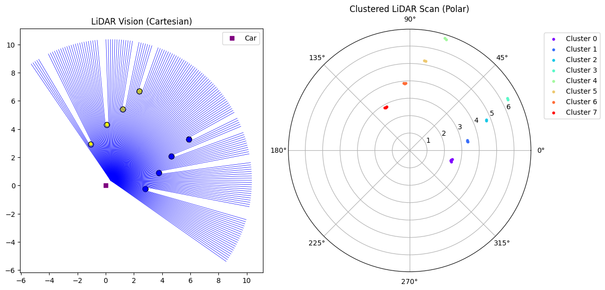

Lidar Perception Pipeline Tutorial
==================================

Welcome to the **LiDAR Perception Tutorial** — your first step into seeing the world of autonomous perception!

This tutorial is designed for new members of the MUR Autonomous team and will walk you through how our simulated LiDAR system detects cones, estimates their positions, and feeds them into the autonomy pipeline.

.. contents::
   :local:
   :depth: 2

Setting the Stage
--------------------

Our vehicle is equipped with a **LiDAR sensor** mounted at the front. It spins in an arc, casting rays and measuring distances to detect obstacles — in our case, **cones**.

.. code-block:: python

   from lidar import Lidar
   lidar = Lidar(car)

This initializes the LiDAR system and attaches it to the `car`. It sets parameters such as:

- **Range:** 0.1 m to 10.0 m
- **Field of view:** ±80 degrees
- **Resolution:** π/200 radians

Each frame, the LiDAR "scans" and attempts to detect cones around the car.

How LiDAR "Sees"
--------------------

The key perception happens in :py:meth:`Lidar.sense_obstacle_fast`.

.. code-block:: python

   lidar.sense_obstacle_fast()

This casts out virtual rays in the car's heading and checks whether they hit cone-like objects using a geometric trick — ray-circle intersection!

Ray-Circle Intersection Explained
~~~~~~~~~~~~~~~~~~~~~~~~~~~~~~~~~~~~

.. code-block:: python

   def ray_circle_intersection(self, o, d, c, r):
       ...

This function determines if a ray (origin `o`, direction `d`) intersects a cone modeled as a circle (`c`, radius `r`). If an intersection exists within LiDAR range, it's added to the `sense_data`.

Visualizing the LiDAR Scan
-----------------------------

Want to *see* what LiDAR sees? Use:

.. code-block:: python

   lidar.plot_lidar()

This opens a dual view:

- **Left:** Cartesian rays (each ray = one LiDAR reading)
- **Right:** Polar plot of cone clusters

From Points to Clusters
-----------------------------

The LiDAR doesn’t "see cones" — it sees scattered points. To extract cones, we use **clustering**.

.. code-block:: python

   lidar.clusters = lidar.fast_euclidean_clustering()

We group nearby points using a fast KD-tree-based clustering method. Each cluster should (ideally) correspond to one cone.

Estimating Cone Centers
--------------------------

Once clusters are found, we estimate where the cone *actually* is:

.. code-block:: python

   lidar.estimate_cone_center(cluster)

Depending on the number of points:
- 1 point → backproject
- 2 points → midpoint + perpendicular offset
- 3+ points → solve for the circle that fits

Creating Detected Cones
---------------------------

We convert cluster centers + color back to usable cone objects:

.. code-block:: python

   lidar.get_detected_cones()

Each `Cone` has an estimated `(x, y)` and color.

Interactive Exercise: Play with Parameters
--------------------------------------------

Try modifying these values and re-running the simulation:

1. **Resolution** — What happens if you make `resolution = math.pi/50`?
2. **Range** — What if `range_max = 5.0`?
3. **Noise** — What if you add random noise to cone positions?

.. code-block:: python

   lidar.noise = 0.1  # Add this in the update loop

Challenge: Add a Dynamic Obstacle
------------------------------------

Extend the `sense_obstacle_fast()` function to ignore cones moving faster than 0.5 m/s (hint: use `cone.vx`, `cone.vy` if available).

Summary
----------

In this tutorial, you learned how our LiDAR simulation:

- Casts rays to detect obstacles
- Groups hits into cone-like clusters
- Estimates cone positions and passes them down the pipeline

