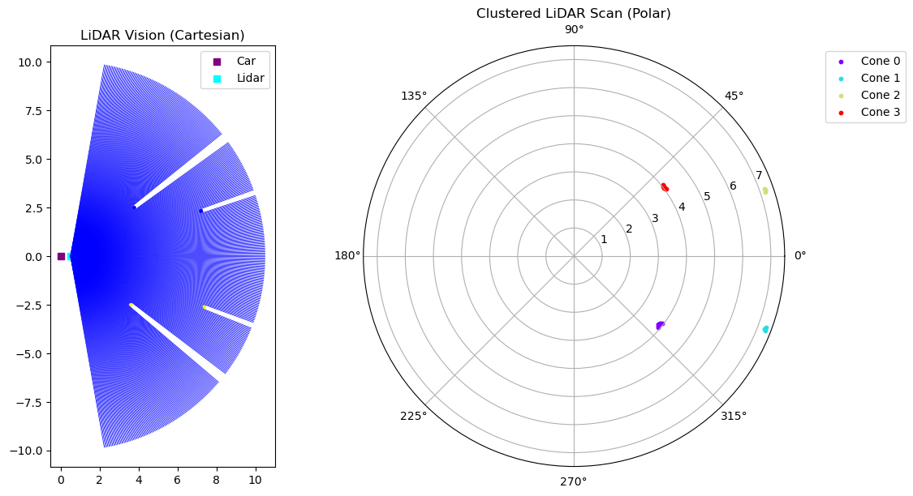
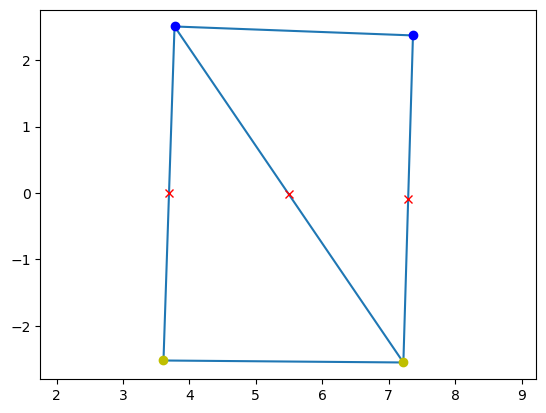

From the LiDAR pipeline to the Path Generation Pipeline
========================================================

Recall that that we stated in the Path Generation Tutorial that the entire track is unknown to the car in the first lap, therefore it will not have any cone positions except for the cones detected by the perception pipeline.

How Do We Pass the Detected Cones?
----------------------------------

From the previous :doc:`tutorial<tut_perception>`, we can return the detected cones from the update function of the LiDAR:

.. code-block:: python
   
   def update(self, Track=None):
      ..
      return self.cones

Suppose we exected and plotted the lidar scan of the car at the starting position as shown below:

The lidar scan shows us that there are four detected cones. We can then apply Delaunay's Triangulation of the detected cones and determine the midpoint of the track boundaries.

.. code-block:: python

   # Recall we named our lidar object as 
   lidar_sensor = Lidar()

   # After adding it to a car, we can use the update method which saves detected cones to the Lidar class variable 'Lidar().cones
   lidar_sensor.update()
   detected_cones = lidar_sensor.cones

   # From the Path Generation Tutorial we can replace:
   ...
   - cone_positions = np.array([cone.get_position() for cone in cones])
   - cone_colors = np.array([cone.color for cone in cones])
   ...

   # to:
   ...
   + cone_positions = np.array([cone.get_position() for cone in detected_cones])
   + cone_colors = np.array([cone.color for cone in detected_cones])
   ...

We should get the following following midpoints:

.. note:: 
   As mentioned in the Lidar tutorial, the detected cones are in the local frame of the car, not the global coordinates.

These midpoints will then be used for path following in the controls pipeline.